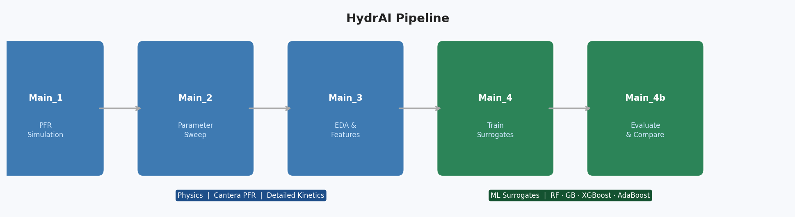

# HydrAI

[](https://www.python.org/)
[](https://cantera.org/)
[](https://scikit-learn.org/)
[](https://xgboost.readthedocs.io/)
[](LICENSE)

**Physics-first simulation of steam cracking, accelerated by machine learning.**

**HydrAI** combines detailed **Cantera** plug-flow reactor (PFR) models with **multi-output tree ensembles** to make reactor screening and design loops practical—without sacrificing the fidelity of large-chemistry simulations.

**Nikolas Karefyllidis, PhD** — [github.com/karefyllidis](https://github.com/karefyllidis)

---



---

## Why it matters

Steam cracking is central to olefin production and among the most energy-intensive unit operations in the chemical industry. Accurate predictions require **stiff integration coupled to detailed kinetics** (10²–10³ species)—fidelity that is non-negotiable for R&D, but prohibitively slow for repeated design and optimisation loops.

HydrAI addresses this with a **reproducible, full-stack workflow**:

1. **Generate ground truth** — run Cantera PFR simulations across a broad parameter space for multiple feedstocks (ethane, propane, n-hexane, naphtha).
2. **Build a fast surrogate** — train multi-output tree ensembles on those simulations; inference takes **milliseconds vs. seconds-to-minutes** for a full chemistry solve.
3. **Evaluate rigorously** — held-out test metrics (R², RMSE, MAPE, MBE) per model and per output target in a dedicated comparison notebook.

Representative surrogate accuracy on a large n-hexane dataset: mean test **R² ~ 0.97–0.99** across thermodynamic state variables and species concentrations.

---

## What you get

| | |
|--|--|
| **High-fidelity baseline** | PFR with configurable heat flux, pressure drop (Churchill), and multi-feed kinetics from industry-style YAML mechanisms (35–1951 species). |
| **Scalable dataset generation** | Latin Hypercube or structured grid sweeps over 6 operating/geometry parameters; **parallel** on a workstation or **SLURM-chunked** on HPC. |
| **Multi-reactant scope** | A single trained surrogate generalises across chemically distinct feedstocks — ethane, propane, n-hexane, naphtha — not just parameter interpolation within one feed. |
| **Production-style ML pipeline** | Random Forest, Gradient Boosting, XGBoost, AdaBoost; optional `RandomizedSearchCV`; `MLPFRPredictor` for sub-ms batch inference from saved artifacts. |
| **Clean architecture** | JSON configs per concern (simulation / ML / style); notebooks for the end-to-end pipeline; importable library under `src/`. |

---

## Workflow

```
Main_1 → Main_2 → Main_3 → Main_4 → Main_4b
  PFR      Sweep   EDA /    Train    Metrics
           data    feat.    trees    & plots
```

Full notebook descriptions and config key reference: [STRUCTURE.md](STRUCTURE.md) · [docs/ML_CONFIG_GUIDE.md](docs/ML_CONFIG_GUIDE.md)

---

## Get started

```bash
git clone https://github.com/karefyllidis/HydrAI.git
cd HydrAI
pip install -r requirements.txt
```

1. Install **Cantera** for your Python interpreter ([guide](https://cantera.org/stable/install/windows.html)).
2. Place mechanism **YAML** files in `mechanisms/` — filenames are declared in `configs/simulation/reactant_database.json` (mechanisms are **git-ignored** by design).
3. Run the notebooks in order under `notebooks/`, or `python run_pipeline.py` (`run_pipeline.bat` on Windows) once data exists.
4. For parallel sweeps on one machine: `python scripts/local/run_main2_local_parallel.py --ntasks 4`.

---

## Roadmap

- [x] Multi-feed PFR + detailed kinetics
- [x] LHS / grid sampling, SLURM-aware parallel generation
- [x] Multi-output tree surrogates, hyperparameter tuning, comparison notebook
- [ ] PyTorch / physics-informed surrogate models
- [ ] Bayesian / gradient-free design optimisation on top of fast predictors

---

## Contributing · License

[.github/CONTRIBUTING.md](.github/CONTRIBUTING.md) · [MIT](LICENSE) © Nikolas Karefyllidis
