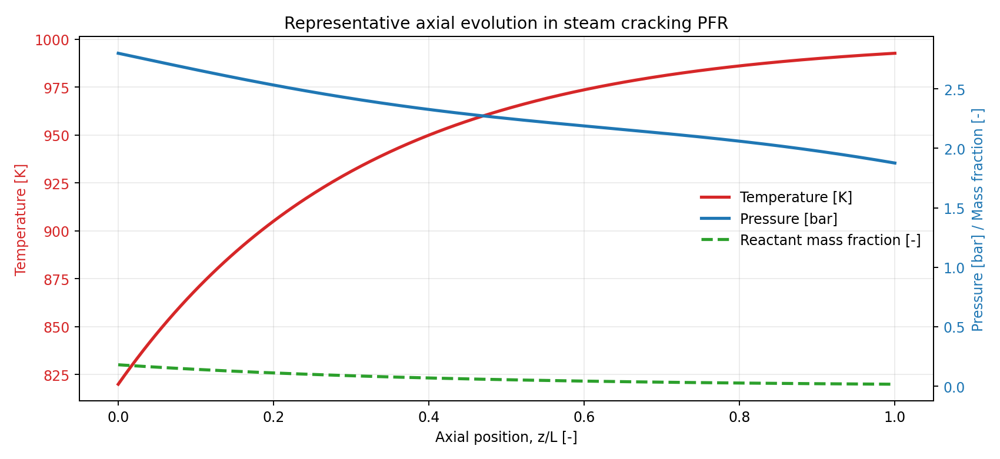

# HydrAI

[](https://www.python.org/)
[](https://cantera.org/)
[](https://scikit-learn.org/)
[](https://xgboost.readthedocs.io/)
[](LICENSE)

> **HydrAI = Hydrocarbon + AI** — physics-grounded steam-cracking simulation with machine-learning surrogates for fast reactor screening and design.

**Nikolas Karefyllidis, PhD** — [GitHub](https://github.com/karefyllidis) · [LinkedIn](https://www.linkedin.com/in/karefyllidis/) · [Google Scholar](https://scholar.google.co.uk/citations?user=kLGU85cAAAAJ&hl=en)

Parts of the scientific foundation for this project originate from prior doctoral work: [University of Oxford thesis repository entry](https://ora.ox.ac.uk/objects/uuid:2479abe8-fefb-4574-b573-a309c278a614).

---

## Why it matters

Steam cracking is central to olefin production and one of the most energy-intensive unit operations in the chemical industry. Accurate predictions demand **stiff ODE integration coupled to detailed kinetics** — mechanisms of 10²–10³ species — fidelity that is essential for R&D but far too slow for iterative design.

HydrAI closes that gap with a **reproducible, full-stack workflow**:

1. **Simulate** — Cantera PFR solver sweeping a broad operating space across multiple feedstocks (ethane, propane, n-hexane, naphtha).
2. **Surrogateify** — multi-output tree ensembles trained on that data; inference is **milliseconds vs. seconds–minutes** for a full chemistry solve.
3. **Evaluate** — rigorous held-out metrics (R², RMSE, MAPE, MBE) per model and per output target in a dedicated comparison notebook.

Representative accuracy on a large n-hexane dataset: mean test **R² ~ 0.97–0.99** across all thermodynamic state variables and species concentrations.

---

## What you get

| | |
|--|--|
| **High-fidelity baseline** | PFR with configurable wall heat flux, Churchill pressure drop, and multi-feed YAML kinetics (35–1951 species). |
| **Scalable dataset generation** | Latin Hypercube or structured grid sweeps over 6 parameters; parallel on a workstation or SLURM-chunked on HPC. |
| **Multi-reactant generalisation** | One surrogate trained across chemically distinct feedstocks — not just interpolation within a single feed. |
| **Production ML pipeline** | RF, Gradient Boosting, XGBoost, AdaBoost; optional `RandomizedSearchCV`; `MLPFRPredictor` for sub-ms batch inference. |
| **Clean, extensible architecture** | JSON configs per concern (simulation / ML / style); Jupyter notebooks as the end-to-end interface; importable `src/` library. |

---

## Axial profiles



*Typical axial evolution along normalized reactor length (z/L): temperature rise, pressure drop, and reactant depletion — the full-resolution targets HydrAI learns to predict.*

---

## Repository structure

    HydrAI/
    ├── notebooks/            # Main_1 .. Main_4b  ·  PFR → sweep → EDA → train → compare
    ├── src/                  # cantera/, ml/, utils/
    ├── configs/              # simulation/, ml/, style/
    ├── scripts/              # cluster/, local/, dev/
    ├── data/                 # training/, processed/ (generated; git-ignored)
    ├── models/               # trained artifacts (generated; git-ignored)
    ├── mechanisms/           # local YAML kinetic files (git-ignored)
    └── docs/                 # guides, API reference, structure trees

---

## Get started

```bash
git clone https://github.com/karefyllidis/HydrAI.git
cd HydrAI
pip install -r requirements.txt
```

1. Install **Cantera** for your interpreter ([guide](https://cantera.org/stable/install/windows.html)).
2. Place mechanism **YAML** files in `mechanisms/` — paths declared in `configs/simulation/reactant_database.json`.
3. Run notebooks in order under `notebooks/`, or `python run_pipeline.py` once data exists.
4. Parallel sweeps on one machine: `python scripts/local/run_main2_local_parallel.py --ntasks 4`.

→ Full config keys: [docs/ML_CONFIG_GUIDE.md](docs/ML_CONFIG_GUIDE.md) · Detailed layout: [docs/STRUCTURE.md](docs/STRUCTURE.md)

---

## Roadmap

- [x] Multi-feed PFR with detailed chemistry
- [x] LHS / grid sampling, SLURM-aware parallel data generation
- [x] Multi-output tree surrogates, hyperparameter tuning, comparison notebook
- [ ] PyTorch / physics-informed neural surrogate
- [ ] Bayesian / gradient-free design optimisation loop

---

## Contributing · License

[.github/CONTRIBUTING.md](.github/CONTRIBUTING.md) · [MIT](LICENSE) © Nikolas Karefyllidis

## Model cards

- Repository model card: [MODEL_CARD.md](MODEL_CARD.md)
- Hugging Face-ready template: [docs/HF_MODEL_CARD_TEMPLATE.md](docs/HF_MODEL_CARD_TEMPLATE.md)
